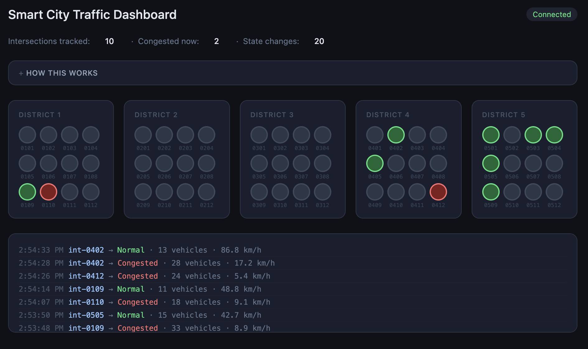

# Smart City Traffic — Kafka on Kubernetes Demo

A fully orchestrated event streaming pipeline running on your laptop. Simulates
hundreds of road sensors across a fictional city, filters and aggregates the
stream, and displays live traffic state on a web dashboard.

Built to demonstrate **why Kafka exists** and **how it differs from a message
queue like RabbitMQ** — through working code you can actually run.



---

## What's running

```
sensor-simulator  →  raw-sensor-events  →  filter-service  →  intersection-events  →  aggregator-service  →  signal-state-changes  →  dashboard-service  →  browser
    ~20 events/sec        6 partitions         drops ~64%         4 partitions            only on change          4 partitions              SignalR / WebSocket
```

| Service | Language | Role |
|---|---|---|
| `sensor-simulator` | C# | Produces fake sensor events to `raw-sensor-events` |
| `filter-service` | C# | Drops non-intersection events, forwards the rest |
| `aggregator-service` | C# | Maintains rolling 30s windows, publishes state changes |
| `dashboard-service` | C# / ASP.NET Core | Consumes state changes, pushes to browser via SignalR |

---

## Prerequisites

Install these before you begin:

- [Docker Desktop](https://www.docker.com/products/docker-desktop/) — for building images
- [minikube](https://minikube.sigs.k8s.io/docs/start/) — local Kubernetes cluster
- [kubectl](https://kubernetes.io/docs/tasks/tools/install-kubectl-macos/) — Kubernetes CLI
- [Helm](https://helm.sh/docs/intro/install/) — not required by this demo but useful to have
- [.NET 10 SDK](https://dotnet.microsoft.com/download) — to build the C# services

On a Mac with Homebrew:

```bash
brew install minikube kubectl
brew install --cask docker
```

Download the .NET 10 SDK from [dot.net](https://dotnet.microsoft.com/download).

---

## Project structure

```
.
├── k8s/
│   ├── kafka/
│   │   └── kafka.yaml               # Kafka StatefulSet + Service + ConfigMap
│   ├── sensor-simulator.yaml
│   ├── filter-service.yaml
│   ├── aggregator-service.yaml
│   └── dashboard-service.yaml
├── SensorSimulator/
│   ├── Program.cs
│   ├── SensorEvent.cs
│   ├── CitySimulator.cs
│   └── Dockerfile
├── FilterService/
│   ├── Program.cs
│   └── Dockerfile
├── AggregatorService/
│   ├── Program.cs
│   ├── SignalState.cs
│   └── Dockerfile
└── DashboardService/
    ├── Program.cs
    ├── TrafficHub.cs
    ├── IntersectionStateStore.cs
    ├── wwwroot/
    │   └── index.html
    └── Dockerfile
```

---

## Getting started

### 1. Start minikube

```bash
minikube start
kubectl get nodes
```

You should see one node with `STATUS = Ready`.

### 2. Deploy Kafka

```bash
kubectl apply -f k8s/kafka/kafka.yaml
kubectl get pods -n kafka --watch
```

Wait for `kafka-0` to show `1/1 Running`. Then create the three topics:

```bash
kubectl exec -it kafka-client -n kafka -- /bin/bash
```

Inside the pod:

```bash
export PATH=$PATH:/opt/kafka/bin

kafka-topics.sh --bootstrap-server kafka:9092 --create --topic raw-sensor-events --partitions 6 --replication-factor 1
kafka-topics.sh --bootstrap-server kafka:9092 --create --topic intersection-events --partitions 4 --replication-factor 1
kafka-topics.sh --bootstrap-server kafka:9092 --create --topic signal-state-changes --partitions 4 --replication-factor 1

kafka-topics.sh --bootstrap-server kafka:9092 --list
```

Exit the pod with `exit`.

### 3. Point Docker at minikube

This is required before every build so images land inside minikube rather than
your Mac's local Docker:

```bash
eval $(minikube docker-env)
```

### 4. Build and deploy all services

Run each block in order:

```bash
# Sensor simulator
cd SensorSimulator
docker build -t sensor-simulator:latest .
cd ..
kubectl apply -f k8s/sensor-simulator.yaml

# Filter service
cd FilterService
docker build -t filter-service:latest .
cd ..
kubectl apply -f k8s/filter-service.yaml

# Aggregator service
cd AggregatorService
docker build -t aggregator-service:latest .
cd ..
kubectl apply -f k8s/aggregator-service.yaml

# Dashboard service
cd DashboardService
docker build -t dashboard-service:latest .
cd ..
kubectl apply -f k8s/dashboard-service.yaml
```

Check everything is running:

```bash
kubectl get pods -n kafka
```

You should see five pods all showing `1/1 Running`:

```
NAME                                 READY   STATUS    RESTARTS
aggregator-service-xxx               1/1     Running   0
dashboard-service-xxx                1/1     Running   0
filter-service-xxx                   1/1     Running   0
kafka-0                              1/1     Running   0
sensor-simulator-xxx                 1/1     Running   0
```

### 5. Open the dashboard

```bash
minikube service dashboard-service -n kafka
```

Your browser will open automatically. You should see the city map appear within
a few seconds as intersections are discovered from the event stream.

---

## The demo moment — replaying events

This is the clearest way to see what makes Kafka different from RabbitMQ.

While the pipeline is running, scale the dashboard down to zero:

```bash
kubectl scale deployment/dashboard-service -n kafka --replicas=0
```

Wait 30 seconds — state changes are piling up in `signal-state-changes` unread.
Now bring it back:

```bash
kubectl scale deployment/dashboard-service -n kafka --replicas=1
minikube service dashboard-service -n kafka
```

The dashboard replays every missed state change and catches up to the present.
In RabbitMQ, those messages would have been lost the moment the consumer
disconnected.

---

## Watching the pipeline

Follow logs for each service in separate terminals:

```bash
# What the simulator is producing
kubectl logs -n kafka deployment/sensor-simulator --follow

# Filter pass/drop rates
kubectl logs -n kafka deployment/filter-service --follow

# State changes being published
kubectl logs -n kafka deployment/aggregator-service --follow

# What the dashboard is broadcasting
kubectl logs -n kafka deployment/dashboard-service --follow
```

---

## Key Kafka concepts demonstrated

| Concept | Where you see it |
|---|---|
| **Topics as durable logs** | Restarting a consumer replays missed events |
| **Consumer groups** | Four independent services reading the same broker |
| **Partition keys** | `districtId` ensures ordered delivery per district |
| **Offset tracking** | Each service picks up exactly where it left off |
| **Event-time vs processing-time** | `timestampUtc` from the sensor, not the broker |
| **State transitions** | Aggregator publishes changes, not raw readings |

---

## Teardown

```bash
minikube delete
```

This removes the entire VM, cluster, and all data.

---

## Why not RabbitMQ?

RabbitMQ is a message broker — it delivers messages from A to B and deletes them
once consumed. It is excellent for job queues, RPC patterns, and transient
notifications.

Kafka is an event log — it appends events durably and lets any number of
consumers read them independently, at their own pace, from any point in history.
It is the right choice when you need replay, fan-out to independent consumers,
or long-term event retention.

This demo uses Kafka because the dashboard, the aggregator, and a hypothetical
ML model can all consume the same raw sensor stream without any of them knowing
the others exist. Add a new consumer tomorrow and it can read six months of
history. That is not possible with RabbitMQ.
